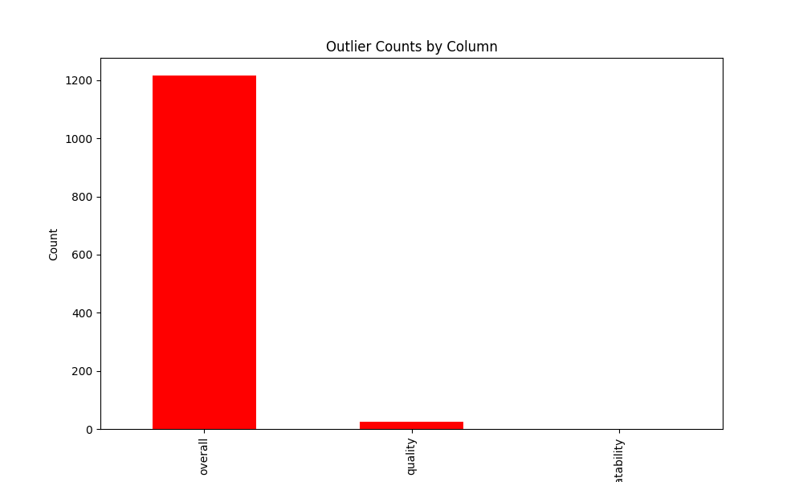
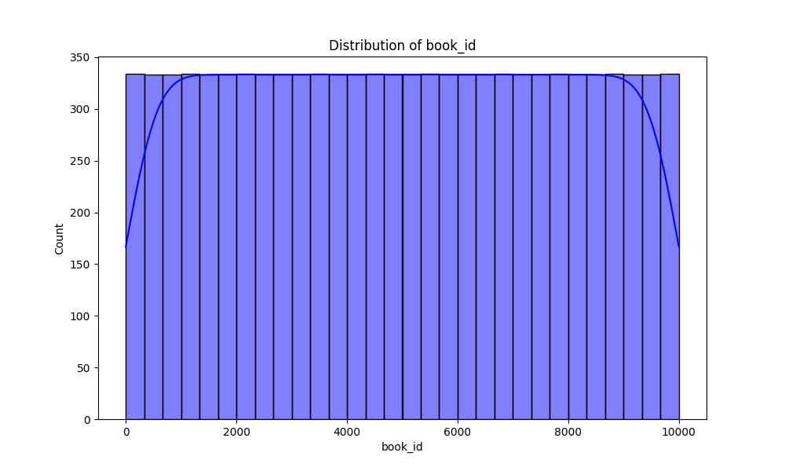

# Data Analysis Report

## Summary Statistics
|        |   book_id |   goodreads_book_id |     best_book_id |         work_id |   books_count |         isbn |         isbn13 | authors      |   original_publication_year | original_title   | title          | language_code   |   average_rating |    ratings_count |   work_ratings_count |   work_text_reviews_count |   ratings_1 |   ratings_2 |   ratings_3 |      ratings_4 |       ratings_5 | image_url                                                                                | small_image_url                                                                        |
|:-------|----------:|--------------------:|-----------------:|----------------:|--------------:|-------------:|---------------:|:-------------|----------------------------:|:-----------------|:---------------|:----------------|-----------------:|-----------------:|---------------------:|--------------------------:|------------:|------------:|------------:|---------------:|----------------:|:-----------------------------------------------------------------------------------------|:---------------------------------------------------------------------------------------|
| count  |  10000    |     10000           |  10000           | 10000           |    10000      | 9300         | 9415           | 10000        |                    9979     | 9415             | 10000          | 8916            |     10000        |  10000           |      10000           |                  10000    |    10000    |    10000    |     10000   | 10000          | 10000           | 10000                                                                                    | 10000                                                                                  |
| unique |    nan    |       nan           |    nan           |   nan           |      nan      | 9300         |  nan           | 4664         |                     nan     | 9274             | 9964           | 25              |       nan        |    nan           |        nan           |                    nan    |      nan    |      nan    |       nan   |   nan          |   nan           | 6669                                                                                     | 6669                                                                                   |
| top    |    nan    |       nan           |    nan           |   nan           |      nan      |    3.757e+08 |  nan           | Stephen King |                     nan     |                  | Selected Poems | eng             |       nan        |    nan           |        nan           |                    nan    |      nan    |      nan    |       nan   |   nan          |   nan           | https://s.gr-assets.com/assets/nophoto/book/111x148-bcc042a9c91a29c1d680899eff700a03.png | https://s.gr-assets.com/assets/nophoto/book/50x75-a91bf249278a81aabab721ef782c4a74.png |
| freq   |    nan    |       nan           |    nan           |   nan           |      nan      |    1         |  nan           | 60           |                     nan     | 5                | 4              | 6341            |       nan        |    nan           |        nan           |                    nan    |      nan    |      nan    |       nan   |   nan          |   nan           | 3332                                                                                     | 3332                                                                                   |
| mean   |   5000.5  |         5.2647e+06  |      5.47121e+06 |     8.64618e+06 |       75.7127 |  nan         |    9.75504e+12 | nan          |                    1981.99  | nan              | nan            | nan             |         4.00219  |  54001.2         |      59687.3         |                   2919.96 |     1345.04 |     3110.89 |     11475.9 | 19965.7        | 23789.8         | nan                                                                                      | nan                                                                                    |
| std    |   2886.9  |         7.57546e+06 |      7.82733e+06 |     1.17511e+07 |      170.471  |  nan         |    4.42862e+11 | nan          |                     152.577 | nan              | nan            | nan             |         0.254427 | 157370           |     167804           |                   6124.38 |     6635.63 |     9717.12 |     28546.4 | 51447.4        | 79768.9         | nan                                                                                      | nan                                                                                    |
| min    |      1    |         1           |      1           |    87           |        1      |  nan         |    1.9517e+08  | nan          |                   -1750     | nan              | nan            | nan             |         2.47     |   2716           |       5510           |                      3    |       11    |       30    |       323   |   750          |   754           | nan                                                                                      | nan                                                                                    |
| 25%    |   2500.75 |     46275.8         |  47911.8         |     1.00884e+06 |       23      |  nan         |    9.78032e+12 | nan          |                    1990     | nan              | nan            | nan             |         3.85     |  13568.8         |      15438.8         |                    694    |      196    |      656    |      3112   |  5405.75       |  5334           | nan                                                                                      | nan                                                                                    |
| 50%    |   5000.5  |    394966           | 425124           |     2.71952e+06 |       40      |  nan         |    9.78045e+12 | nan          |                    2004     | nan              | nan            | nan             |         4.02     |  21155.5         |      23832.5         |                   1402    |      391    |     1163    |      4894   |  8269.5        |  8836           | nan                                                                                      | nan                                                                                    |
| 75%    |   7500.25 |         9.38223e+06 |      9.63611e+06 |     1.45177e+07 |       67      |  nan         |    9.78083e+12 | nan          |                    2011     | nan              | nan            | nan             |         4.18     |  41053.5         |      45915           |                   2744.25 |      885    |     2353.25 |      9287   | 16023.5        | 17304.5         | nan                                                                                      | nan                                                                                    |
| max    |  10000    |         3.32886e+07 |      3.55342e+07 |     5.63996e+07 |     3455      |  nan         |    9.79001e+12 | nan          |                    2017     | nan              | nan            | nan             |         4.82     |      4.78065e+06 |          4.94236e+06 |                 155254    |   456191    |   436802    |    793319   |     1.4813e+06 |     3.01154e+06 | nan                                                                                      | nan                                                                                    |

## Missing Data
|                           |    0 |
|:--------------------------|-----:|
| book_id                   |    0 |
| goodreads_book_id         |    0 |
| best_book_id              |    0 |
| work_id                   |    0 |
| books_count               |    0 |
| isbn                      |  700 |
| isbn13                    |  585 |
| authors                   |    0 |
| original_publication_year |   21 |
| original_title            |  585 |
| title                     |    0 |
| language_code             | 1084 |
| average_rating            |    0 |
| ratings_count             |    0 |
| work_ratings_count        |    0 |
| work_text_reviews_count   |    0 |
| ratings_1                 |    0 |
| ratings_2                 |    0 |
| ratings_3                 |    0 |
| ratings_4                 |    0 |
| ratings_5                 |    0 |
| image_url                 |    0 |
| small_image_url           |    0 |

## Skewness
|                           |          0 |
|:--------------------------|-----------:|
| book_id                   |   0        |
| goodreads_book_id         |   1.34525  |
| best_book_id              |   1.35031  |
| work_id                   |   1.76305  |
| books_count               |   8.41009  |
| isbn13                    | -17.7623   |
| original_publication_year | -14.7552   |
| average_rating            |  -0.511617 |
| ratings_count             |  13.0589   |
| work_ratings_count        |  12.4145   |
| work_text_reviews_count   |   9.1302   |
| ratings_1                 |  37.7116   |
| ratings_2                 |  16.4927   |
| ratings_3                 |  10.3995   |
| ratings_4                 |  10.8069   |
| ratings_5                 |  16.3735   |

## Kurtosis
|                           |           0 |
|:--------------------------|------------:|
| book_id                   |   -1.2      |
| goodreads_book_id         |    0.688732 |
| best_book_id              |    0.746497 |
| work_id                   |    2.49411  |
| books_count               |   95.303    |
| isbn13                    |  323.641    |
| original_publication_year |  240.597    |
| average_rating            |    0.882119 |
| ratings_count             |  258.746    |
| work_ratings_count        |  234.072    |
| work_text_reviews_count   |  134.047    |
| ratings_1                 | 2289.61     |
| ratings_2                 |  494.066    |
| ratings_3                 |  160.828    |
| ratings_4                 |  174.026    |
| ratings_5                 |  419.881    |

## Correlation Matrix

## Outliers
|                           |    0 |
|:--------------------------|-----:|
| book_id                   |    0 |
| goodreads_book_id         |  345 |
| best_book_id              |  357 |
| work_id                   |  601 |
| books_count               |  844 |
| isbn13                    |  556 |
| original_publication_year | 1031 |
| average_rating            |  158 |
| ratings_count             | 1163 |
| work_ratings_count        | 1143 |
| work_text_reviews_count   | 1005 |
| ratings_1                 | 1140 |
| ratings_2                 | 1156 |
| ratings_3                 | 1149 |
| ratings_4                 | 1131 |
| ratings_5                 | 1158 |

## Data Distribution

